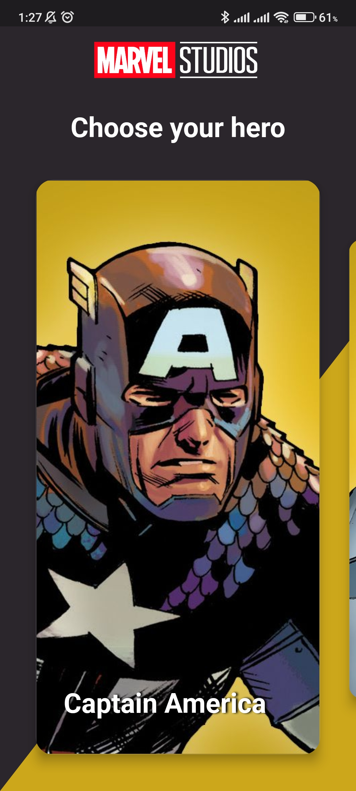

# Marvel Heroes App

<p align="center">
  
</p>

## About The Project
The project was created as part of an internship at [Effective](https://effective.band/).

Work on this project has helped to master a significant range of technologies.

## Topics

* Flutter Based UI
* [Hero Widget](https://docs.flutter.dev/development/ui/animations/hero-animations)
* Navigation
* Network (Working with the API using the [dio](https://pub.dev/packages/dio) library)
* Implementation of data storage on the device using [Drift](https://pub.dev/packages/drift)
* [Firebase](https://firebase.google.com/) to send **push** notifications
* Architecture [Riverpod](https://riverpod.dev/)
* Localization
* Theming
* Portrait / Landscape screen orientation
* Building the release version of the application

## Screenshots

### Screens

|                        Main                         |                        Details                         |
|:---------------------------------------------------:|:------------------------------------------------------:|
|  |  |


### Theiming

|                     Light Theme                      |                     Dark Theme                      |
|:----------------------------------------------------:|:---------------------------------------------------:|
|  |  | 


### Orientation

|                       Light Theme                       |                       Dark Theme                        |
|:-------------------------------------------------------:|:-------------------------------------------------------:|
|  |  | 


## How to run
* You need Android Studio (at least Arctic Fox) with Flutter plugin
* You need to register on the website [Marvel Api](https://developer.marvel.com/) and get the keys
* Next you need to add the `.env` file to the root project and insert 2 variables into this file:
   ```sh
   SECRET_KEY=<Your secret key>
   API_KEY=<Your secret key>
   ```
* Run -> Run 'app'

## Known issues
* The used API has a limit of 3000 calls per day


